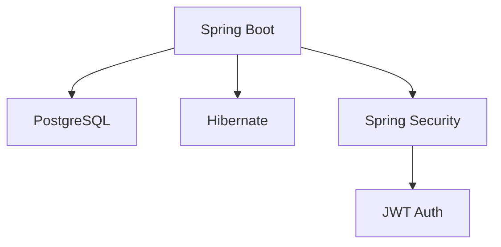
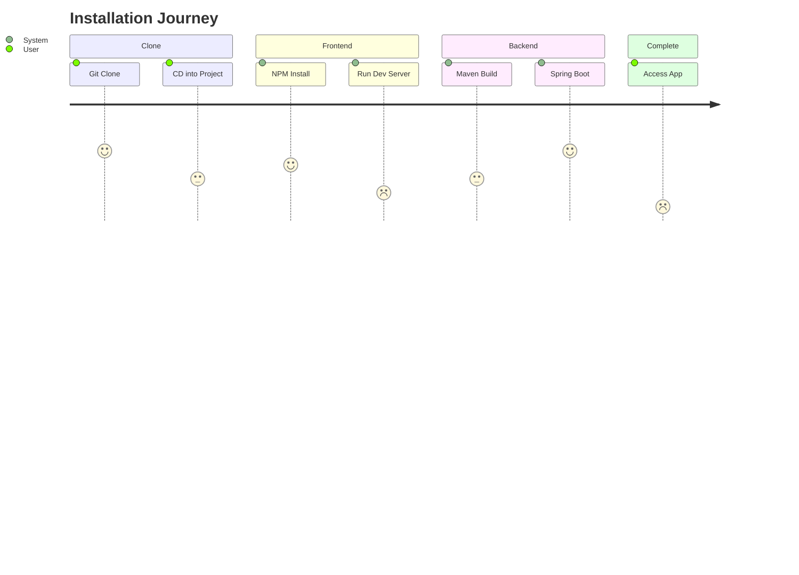

# 🏠 Home Insurance Management System  

  
  
<em>Screenshot of the application dashboard</em>

A modern web application designed to **simplify home insurance operations** with efficient policy management, claims processing, and customer relationship tools.

## ✨ Key Features

### 📑 Policy Management
| Feature | Description |
|---------|-------------|
| Policy Lifecycle | Create, view, update, and delete insurance policies |
| Renewals | Automated policy renewal reminders |
| Customization | Flexible coverage options and add-ons |

### 👥 Customer Portal
| Feature | Description |
|---------|-------------|
| Secure Profiles | Encrypted customer data storage |
| Self-Service | Policy management without agent assistance |
| Document Hub | Secure upload and storage of claim documents |

### ⚡ Claims Processing
| Feature | Description |
|---------|-------------|
| Intuitive Workflow | Step-by-step claims submission |
| Real-Time Tracking | Live status updates for claims |
| Smart Validation | Automated checks for claim completeness |

# 🏗️ System Architecture

# Clone the repository
- git clone https://github.com/Spyabhishek/Home-Insurance-Management-System.git
- cd Home-Insurance-Management-System

# Frontend setup
- cd frontend
- npm install
- npm run dev

# Backend setup
- cd ../backend
- mvn spring-boot:run